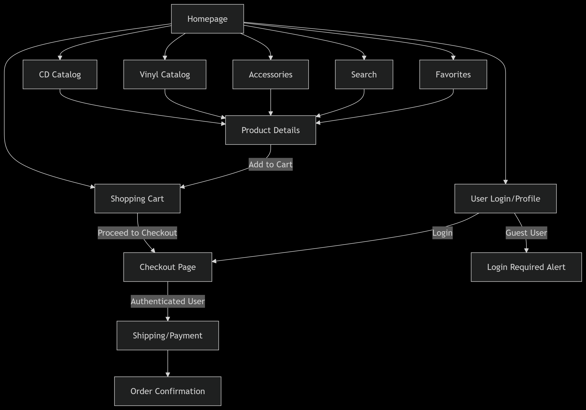

# SCC0219 – Milestone 1 - An Online Store

**Authors**:  
Eduardo Pereira De Luna Freire, 14567304  
Laura Fernandes Camargos, 13692334  
Sandy da Costa Dutra, 12544570  

---

## Requirements

### User Types
- **Administrators**:
  - Manage other administrators, customers, and products.
  - Predefined account: `admin` (password: `admin`).
  - Required data: name, ID, phone, email.
  
- **Customers**:
  - Purchase vinyl records, CDs, and accessories.
  - Required data: name, ID, address, phone, email.

### Product Management
- **Products** include vinyl records, CDs, and accessories (player and support).
- **Required product data**: name, ID, photo, description, price, stock quantity, sold quantity.
- **CRUD operations**: Administrators can Create, Read, Update, and Delete products.

### Sales Functionality
- Shopping cart system with product selection and quantity adjustment.
- Credit/Debit card and PIX payment.
- Automatic stock update after purchase:
  - Decrease `stock quantity`.
  - Increase `sold quantity`.

### Unique Feature
- **Favorite Page**: 
  - Users can save products to a personalized favorites list
  - Syncs across devices when logged in

### Technical Requirements
- Accessibility compliance (screen reader support, high contrast).
- Responsive design (mobile, tablet, desktop).
- Reasonable response times for all operations.

---

## Project Description
JUKEBOX is a vinyl/CD e-commerce platform with customer and admin interfaces, designed to meet the specified requirements through the following implementations:

### System Architecture
- **Frontend**: React.js (responsive UI for desktop/mobile)
- **Backend**: Node.js (REST API)
- **Database**: PostgreSQL (stores users, products)

### Implemented Functionalities

#### User Management
- **Admins**:
  - Access admin dashboard
  - CRUD operations via API endpoints (`POST /api/products`, etc.)
- **Customers**:
  - Signup/login with email validation
  - Profile management (edit address/phone)

#### Product Catalog
- Product cards display:
  - Cover art, price, stock status
- Search & Filters:
  - By genre, artist, release year

#### Shopping Flow
- **Cart System**:
  - Local storage for guest users; synced to DB after login
  - Real-time stock validation at checkout
- **Checkout**:
  - Credit card/PIX payment processing
  - Stock updates: `quantity_in_stock -= ordered_quantity`
### Data to be Stored on Server
#### 1. User Data
```
# Administrators
- id: string (UUID)
- email: string (unique)
- password_hash: string
- name: string
- phone: string

# Customers
- id: string (UUID)
- email: string (unique)
- password_hash: string
- name: string
- CEP: {
    street: string
    city: string
    state: string
    zip_code: string
  }
- phone: string
- favorite_products: [product_id] (array)
```
#### 2. Product Catalog
```
- id: string (UUID)
- sku: string (unique)
- name: string
- type: enum ['vinyl', 'cd', 'accessory']
- price: float
- description: text
- stock_quantity: integer
- sold_quantity: integer (default: 0)
- images: [url] (array)
- metadata: {
    artist: string
    release_year: integer
    genre: string
    condition: enum ['new', 'used']
  }
```
#### 3. Unique Feature
```
user_favorites: {
  user_id: string
  product_ids: [string] (array)
  updated_at: timestamp
}
```
#### 4. Order Management
```
- id: string (UUID)
- user_id: string (reference)
- items: [{
    product_id: string
    quantity: integer
    unit_price: float
  }]
- payment_method: enum ['credit_card', 'pix']
- payment_status: enum ['pending', 'completed', 'failed']
- total_amount: float
- created_at: timestamp
```
### Navigation Diagram
  
**Interactive prototype:** [Open in Figma](https://www.figma.com/proto/mmj99fQmk14IlVF0oD9eUB/Milestone-1?node-id=39-297&t=mGflpH7v4lGAqHeQ-0&scaling=min-zoom&content-scaling=fixed&page-id=0%3A1&starting-point-node-id=39%3A297)
---

## Comments About the Code

---

## Test Plan
*Planned approach:*
- **Backend**: Postman tests for API routes (users, products)
- **Frontend**: Jest unit tests for React components
- **Integration**: Manual testing of checkout flow

---

## Test Results
*Will include:*
- Pass/fail rates for critical user journeys
- Screenshots of test executions

---

## Build Procedures
*Expected setup:*
Node.js + PostgreSQL
```bash

npm install
npm run db:setup
npm start
````
---

## Problems
*Current challenges:*
- Database schema optimization
- Responsive design for mobile devices

---

## Comments
*Next steps:*
- User testing with Figma prototypes
