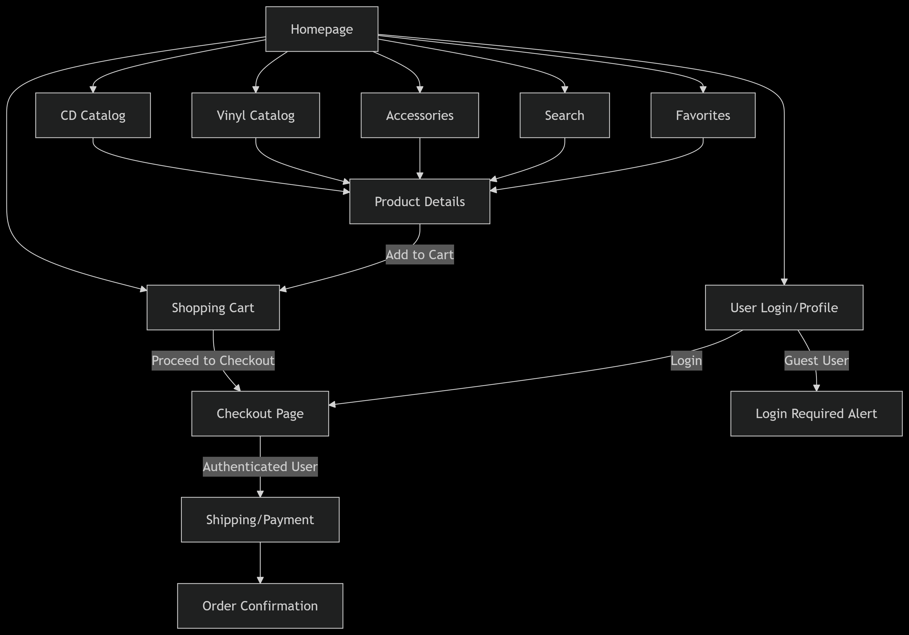
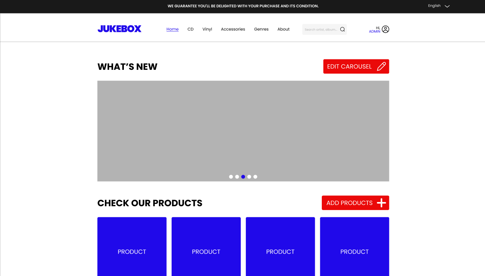
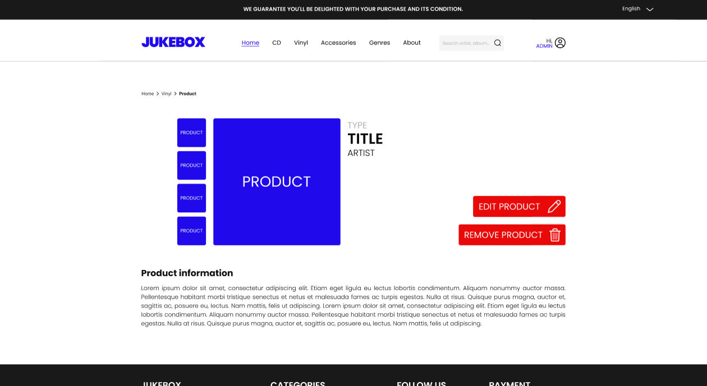

# SCC0219 – Milestone 1 - An Online Store

**Authors**:  
Eduardo Pereira De Luna Freire, 14567304  
Laura Fernandes Camargos, 13692334  
Sandy da Costa Dutra, 12544570  

---

## Project Description
JUKEBOX is a vinyl/CD e-commerce platform with customer and admin interfaces, designed to meet the specified requirements through the following implementations:

### System Architecture
- **Frontend**: React.js (responsive UI for desktop/mobile)
- **Backend**: Node.js (REST API)
- **Database**: PostgreSQL (stores users, products)

### Functionalities

#### User Management
- **Admins**:
  - Access admin dashboard
  - CRUD operations via API endpoints (`POST /api/products`, etc.)
- **Customers**:
  - Signup/login with email validation
  - Profile management (edit address/phone)

#### Product Catalog
- Product cards display:
  - Cover art, price, stock status
- Search & Filters:
  - By genre, artist, release year

#### Shopping Flow
- **Cart System**:
  - Local storage for guest users; synced to DB after login
  - Real-time stock validation at checkout
- **Checkout**:
  - Credit card/PIX payment processing
  - Stock updates: `quantity_in_stock -= ordered_quantity`

---

## Requirements

### User Types
- **Administrators**:
  - Manage other administrators, customers, and products.
  - Predefined account: `admin` (password: `admin`).
  - Required data: name, ID, phone, email.
  
- **Customers**:
  - Purchase vinyl records, CDs, and accessories.
  - Required data: name, ID, address, phone, email.

### Product Management
- **Products** include vinyl records, CDs, and accessories (player and support).
- **Required product data**: name, ID, photo, description, price, stock quantity, sold quantity.
- **CRUD operations**: Administrators can Create, Read, Update, and Delete products.

### Sales Functionality
- Shopping cart system with product selection and quantity adjustment.
- Credit/Debit card and PIX payment.
- Automatic stock update after purchase:
  - Decrease `stock quantity`.
  - Increase `sold quantity`.

### Unique Feature
- **Favorite Page**: 
  - Users can save products to a personalized favorites list
  - Syncs across devices when logged in

### Technical Requirements
- Accessibility compliance (screen reader support, high contrast).
- Responsive design (mobile, tablet, desktop).
- Reasonable response times for all operations.

---

### Data to be Stored on Server
#### 1. User Data
```
# Administrators
- id: string (UUID)
- email: string (unique)
- password_hash: string
- name: string
- phone: string

# Customers
- id: string (UUID)
- email: string (unique)
- password_hash: string
- name: string
- CEP: {
    street: string
    city: string
    state: string
    zip_code: string
  }
- phone: string
- favorite_products: [product_id] (array)
```
#### 2. Product Catalog
```
- id: string (UUID)
- sku: string (unique)
- name: string
- type: enum ['vinyl', 'cd', 'accessory']
- price: float
- description: text
- stock_quantity: integer
- sold_quantity: integer (default: 0)
- images: [url] (array)
- metadata: {
    artist: string
    release_year: integer
    genre: string
    condition: enum ['new', 'used']
  }
```
#### 3. Unique Feature
```
user_favorites: {
  user_id: string
  product_ids: [string] (array)
  updated_at: timestamp
}
```
#### 4. Order Management
```
- id: string (UUID)
- user_id: string (reference)
- items: [{
    product_id: string
    quantity: integer
    unit_price: float
  }]
- payment_method: enum ['credit_card', 'pix']
- payment_status: enum ['pending', 'completed', 'failed']
- total_amount: float
- created_at: timestamp
```
### Navigation Diagram


**Interactive prototype:** [Open in Figma](https://www.figma.com/proto/mmj99fQmk14IlVF0oD9eUB/Milestone-1?node-id=39-297&t=mGflpH7v4lGAqHeQ-0&scaling=min-zoom&content-scaling=fixed&page-id=0%3A1&starting-point-node-id=39%3A297)  

Note: the admin pages are not reachable by the prototype, here's the pages:




  
---

## Functionalities explained

### How to Login to your Client Account

Starting from the Home Page, click on the profile icon.


If you are not logged in, it will take you to the login page.


Then, you need to type your email and password.


If you have made a mistake, it will show the following message:


If you don't fill all the spaces, it will warn you:


If everything goes well, an alert will appear:


### How to Purchase an item

Starting from the Home Page, choose an item to purchase.


Clicking it will lead to the item's page. Then, you need to click "Add to cart".


This will lead you to the cart page. Here, you can choose the quantity and review the price. You may also add more products or remove added items.


If you are happy with how your cart is looking, clicking on the "Buy Shopping Cart" button will lead you to the checkout page, where you can review your purchase, select an address and how you wish to pay:


Clicking "Finish Purchase" will complete the purchase and this pop up will appear:


After you purchase an item, the amount left in stock will change.


### How to Favorite an item (Special Functionality)

Starting from the Home Page, choose an item to favorite.


In the item page, click on the heart button.


This will add the item to your favorite page. You may add as many items as you wish.


---

## Comments About the Code
The HTML structure is organized hierarchically, dividing the website into main sections (header, content, footer). The header and footer are shared between all the pages. For the home page, we added two sections, a "what's new" section that is comprised of a carrousel to show new realeses, and a "products" section, where we display all products. The products are organized in a grid. For the Vinyl, CD and Accessories page, we created a similar grid to the home page, and we created a sidebar where we can choose which genre we want to browse. For the register page, we created a form where the user introduces their information.

---

## Test Plan
*Planned approach:*
- **Backend**: Postman tests for API routes (users, products)
- **Frontend**: Jest unit tests for React components
- **Integration**: Manual testing of checkout flow
- **User login**: frontend/src/mockdata/users.jsx

---

## Test Results
*Will include:*
- Pass/fail rates for critical user journeys
- Screenshots of test executions

---

## How to run

### First, clone the repository

```bash
git clone https://github.com/sandycdutra/jukebox-scc0219.git
cd .\jukebox-scc0219\frontend\
````

### Then install the dependencies

```bash
npm install
````

### Finally, run the project

```bash
npm run dev
````

#### The project is running at http://localhost:5173/
---

## Problems
*Current challenges:*
- Database schema optimization
- Responsive design for mobile devices

---

## Comments
*Next steps:*
- User testing with Figma prototypes
